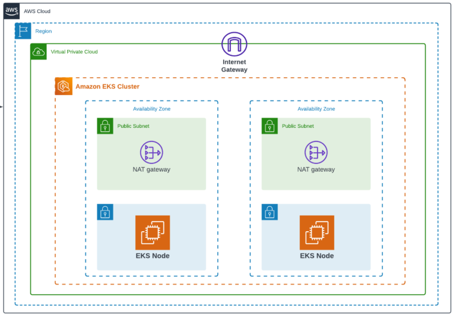
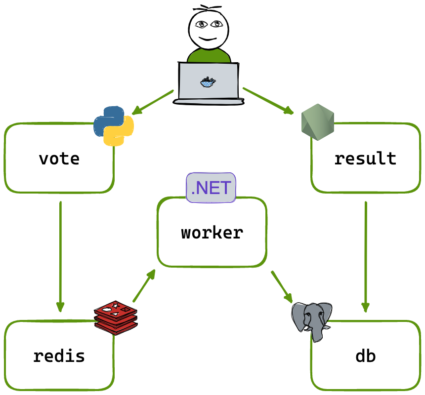

# Building an Amazon EKS Cluster from Scratch with Terraform

Most guides for provisioning Amazon EKS use the AWS community Terraform module for convenience. While this is great for speed, it often abstracts away what’s actually happening behind the scenes.

In this blog, we will build an EKS cluster from scratch using raw Terraform resources (without using the community module). By doing this, you’ll gain a clear understanding of the AWS networking, IAM, and compute resources that make up a Kubernetes cluster on AWS.

Finally, we’ll deploy a sample microservices application (Voting App) on the cluster and access it using port-forwarding.

## Architecture

Here’s how the setup works at a high level:

- VPC is created with 2 Availability Zones for high availability.
- Each AZ contains both a public and a private subnet.
- EKS worker nodes (EC2 instances) are launched in private subnets for better security.
- A NAT Gateway is provisioned in a public subnet to allow worker nodes in private subnets to pull images and updates from the internet (e.g., from ECR, Docker Hub).
- EKS control plane (managed by AWS) communicates with the worker nodes securely within the VPC.
This setup ensures that your nodes are not directly exposed to the internet while still having outbound internet access via the NAT gateway.



## Step 1: Create a VPC with Public and Private Subnets

EKS requires a properly configured VPC with both public and private subnets. Worker nodes generally live in private subnets, while the NAT gateway in public subnets provides outbound internet connectivity. 

We also add Internet Gateway (IGW), NAT Gateway, and route tables to handle connectivity between public/private subnets.


```terraform
################################################################################
# VPC
################################################################################
resource "aws_vpc" "custom_vpc" {
  cidr_block = var.networking.cidr_block

  tags = merge(var.common_tags, {
    Name = "${var.naming_prefix}-VPC"
  })
}

################################################################################
# PUBLIC SUBNETS
################################################################################
resource "aws_subnet" "public_subnets" {
  count                   = var.networking.public_subnets == null || var.networking.public_subnets == "" ? 0 : length(var.networking.public_subnets)
  vpc_id                  = aws_vpc.custom_vpc.id
  cidr_block              = var.networking.public_subnets[count.index]
  availability_zone       = var.networking.azs[count.index]
  map_public_ip_on_launch = true

  tags = merge(var.common_tags, {
    Name                                        = "${var.naming_prefix}-public-subnet-${count.index}"
    "kubernetes.io/role/elb"                    = "1"
    "kubernetes.io/cluster/${var.cluster_name}" = "shared"
  })
}

################################################################################
# PRIVATE SUBNETS
################################################################################
resource "aws_subnet" "private_subnets" {
  count                   = var.networking.private_subnets == null || var.networking.private_subnets == "" ? 0 : length(var.networking.private_subnets)
  vpc_id                  = aws_vpc.custom_vpc.id
  cidr_block              = var.networking.private_subnets[count.index]
  availability_zone       = var.networking.azs[count.index]
  map_public_ip_on_launch = false

  tags = merge(var.common_tags, {
    Name                                        = "${var.naming_prefix}-private-subnet-${count.index}"
    "kubernetes.io/role/internal-elb"           = "1"
    "kubernetes.io/cluster/${var.cluster_name}" = "shared"
  })
}

################################################################################
# INTERNET GATEWAY
################################################################################
resource "aws_internet_gateway" "i_gateway" {
  vpc_id = aws_vpc.custom_vpc.id

  tags = merge(var.common_tags, {
    Name = "${var.naming_prefix}-i-gateway"
  })
}

################################################################################
# EIPs
################################################################################
resource "aws_eip" "elastic_ip" {
  count      = var.networking.private_subnets == null || var.networking.nat_gateways == false ? 0 : length(var.networking.private_subnets)
  depends_on = [aws_internet_gateway.i_gateway]

  tags = merge(var.common_tags, {
    Name = "${var.naming_prefix}-eip-${count.index}"
  })
}

################################################################################
# NAT GATEWAYS
################################################################################
resource "aws_nat_gateway" "nats" {
  count             = var.networking.private_subnets == null || var.networking.nat_gateways == false ? 0 : length(var.networking.private_subnets)
  subnet_id         = aws_subnet.public_subnets[count.index].id
  connectivity_type = "public"
  allocation_id     = aws_eip.elastic_ip[count.index].id
  depends_on        = [aws_internet_gateway.i_gateway]

  tags = merge(var.common_tags, {
    Name = "${var.naming_prefix}-nat-gw-${count.index}"
  })
}

################################################################################
# PUBLIC ROUTE TABLE
################################################################################
resource "aws_route_table" "public_table" {
  vpc_id = aws_vpc.custom_vpc.id
}

resource "aws_route" "public_routes" {
  route_table_id         = aws_route_table.public_table.id
  destination_cidr_block = "0.0.0.0/0"
  gateway_id             = aws_internet_gateway.i_gateway.id
}

resource "aws_route_table_association" "assoc_public_routes" {
  count          = length(var.networking.public_subnets)
  subnet_id      = aws_subnet.public_subnets[count.index].id
  route_table_id = aws_route_table.public_table.id
}

################################################################################
# PRIVATE ROUTE TABLES
################################################################################
resource "aws_route_table" "private_tables" {
  count  = length(var.networking.azs)
  vpc_id = aws_vpc.custom_vpc.id
}

resource "aws_route" "private_routes" {
  count                  = length(var.networking.private_subnets)
  route_table_id         = aws_route_table.private_tables[count.index].id
  destination_cidr_block = "0.0.0.0/0"
  nat_gateway_id         = aws_nat_gateway.nats[count.index].id
}

resource "aws_route_table_association" "assoc_private_routes" {
  count          = length(var.networking.private_subnets)
  subnet_id      = aws_subnet.private_subnets[count.index].id
  route_table_id = aws_route_table.private_tables[count.index].id
}

################################################################################
# SECURITY GROUPS
################################################################################
resource "aws_security_group" "sec_groups" {
  for_each    = { for sec in var.security_groups : sec.name => sec }
  name        = each.value.name
  description = each.value.description
  vpc_id      = aws_vpc.custom_vpc.id

  dynamic "ingress" {
    for_each = try(each.value.ingress, [])
    content {
      description      = ingress.value.description
      from_port        = ingress.value.from_port
      to_port          = ingress.value.to_port
      protocol         = ingress.value.protocol
      cidr_blocks      = ingress.value.cidr_blocks
      ipv6_cidr_blocks = ingress.value.ipv6_cidr_blocks
    }
  }

  dynamic "egress" {
    for_each = try(each.value.egress, [])
    content {
      description      = egress.value.description
      from_port        = egress.value.from_port
      to_port          = egress.value.to_port
      protocol         = egress.value.protocol
      cidr_blocks      = egress.value.cidr_blocks
      ipv6_cidr_blocks = egress.value.ipv6_cidr_blocks
    }
  }
}
```

## Step 2: Create IAM Roles and Policies

EKS needs roles for both the control plane and worker nodes.

- Cluster Role – Grants permissions for EKS to manage AWS resources.
- Node Role – Allows EC2 instances (worker nodes) to join the cluster.

```terraform
################################################################################
# EKS CLUSTER ROLE
################################################################################
resource "aws_iam_role" "EKSClusterRole" {
  name = "EKSClusterRole"
  assume_role_policy = jsonencode({
    Version = "2012-10-17"
    Statement = [
      {
        Action = "sts:AssumeRole"
        Effect = "Allow"
        Principal = {
          Service = "eks.amazonaws.com"
        }
      },
    ]
  })
}

// This policy provides Kubernetes the permissions it requires to manage resources on your behalf. 
// Kubernetes requires Ec2:CreateTags permissions to place identifying information on EC2 resources
// including but not limited to Instances, Security Groups, and Elastic Network Interfaces
resource "aws_iam_role_policy_attachment" "AmazonEKSClusterPolicy" {
  policy_arn = "arn:aws:iam::aws:policy/AmazonEKSClusterPolicy"
  role       = aws_iam_role.EKSClusterRole.name
}

################################################################################
# NODE GROUP ROLE
################################################################################
resource "aws_iam_role" "NodeGroupRole" {
  name = "EKSNodeGroupRole"
  assume_role_policy = jsonencode({
    Version = "2012-10-17"
    Statement = [
      {
        Action = "sts:AssumeRole"
        Effect = "Allow"
        Principal = {
          Service = "ec2.amazonaws.com"
        }
      },
    ]
  })
}

//This policy allows Amazon EKS worker nodes to connect to Amazon EKS Clusters.
resource "aws_iam_role_policy_attachment" "AmazonEKSWorkerNodePolicy" {
  policy_arn = "arn:aws:iam::aws:policy/AmazonEKSWorkerNodePolicy"
  role       = aws_iam_role.NodeGroupRole.name
}

// Provides read-only access to Amazon EC2 Container Registry repositories.
resource "aws_iam_role_policy_attachment" "AmazonEC2ContainerRegistryReadOnly" {
  policy_arn = "arn:aws:iam::aws:policy/AmazonEC2ContainerRegistryReadOnly"
  role       = aws_iam_role.NodeGroupRole.name
}

// This policy provides the Amazon VPC CNI Plugin (amazon-vpc-cni-k8s) the permissions
// it requires to modify the IP address configuration on your EKS worker nodes. 
// This permission set allows the CNI to list, describe, and modify ENIs on your behalf
resource "aws_iam_role_policy_attachment" "AmazonEKS_CNI_Policy" {
  policy_arn = "arn:aws:iam::aws:policy/AmazonEKS_CNI_Policy"
  role       = aws_iam_role.NodeGroupRole.name
}
```

## Step 3: Provision the EKS Cluster

Following creates the EKS control plane.

```terraform
################################################################################
# EKS Cluster
################################################################################
resource "aws_eks_cluster" "eks-cluster" {
  name     = var.cluster_config.name
  role_arn = aws_iam_role.EKSClusterRole.arn
  version  = var.cluster_config.version

  vpc_config {
    subnet_ids         = flatten([var.public_subnets_id, var.private_subnets_id])
    security_group_ids = flatten(var.security_groups_id)
  }

  depends_on = [
    aws_iam_role_policy_attachment.AmazonEKSClusterPolicy
  ]

}
```

At this point, we create a managed set of EC2 worker nodes with basic required addons

```terraform
################################################################################
# NODE GROUP
################################################################################
resource "aws_eks_node_group" "node-ec2" {
  for_each        = { for node_group in var.node_groups : node_group.name => node_group }
  cluster_name    = aws_eks_cluster.eks-cluster.name
  node_group_name = each.value.name
  node_role_arn   = aws_iam_role.NodeGroupRole.arn
  subnet_ids      = flatten(var.private_subnets_id)

  scaling_config {
    desired_size = try(each.value.scaling_config.desired_size, 2)
    max_size     = try(each.value.scaling_config.max_size, 3)
    min_size     = try(each.value.scaling_config.min_size, 1)
  }

  update_config {
    max_unavailable = try(each.value.update_config.max_unavailable, 1)
  }

  ami_type       = each.value.ami_type
  instance_types = each.value.instance_types
  capacity_type  = each.value.capacity_type
  disk_size      = each.value.disk_size
  version        = var.cluster_config.version

  tags = merge(var.common_tags, {
    Name = "${var.naming_prefix}-nodes-${each.value.name}"
  })

  depends_on = [
    aws_iam_role_policy_attachment.AmazonEKSWorkerNodePolicy,
    aws_iam_role_policy_attachment.AmazonEC2ContainerRegistryReadOnly,
    aws_iam_role_policy_attachment.AmazonEKS_CNI_Policy
  ]
}

resource "aws_iam_openid_connect_provider" "eks_oidc_provider" {
  url             = aws_eks_cluster.eks-cluster.identity[0].oidc[0].issuer
  client_id_list  = ["sts.amazonaws.com"]
  thumbprint_list = ["9e99a48a9960b14926bb7f3b02e22da2b0ab7280"]
}


################################################################################
# EKS Addons
################################################################################
data "aws_eks_addon_version" "eks_addons" {
  for_each = var.addons

  addon_name         = each.value.name
  kubernetes_version = aws_eks_cluster.eks-cluster.version
  most_recent        = coalesce(each.value.most_recent, true)
}

resource "aws_eks_addon" "addons" {
  for_each = var.addons

  cluster_name                = aws_eks_cluster.eks-cluster.name
  addon_name                  = each.value.name
  addon_version               = coalesce(each.value.version, data.aws_eks_addon_version.eks_addons[each.key].version)
  resolve_conflicts_on_create = "OVERWRITE"

  tags = merge(var.common_tags, {
    Name = "${var.naming_prefix}-addon-${each.value.name}"
  })

  depends_on = [aws_eks_node_group.node-ec2]
}
```

## Step 4: Configure kubectl and Access Cluster

```terraform
################################################################################
# Update kubeconfig with created cluster
################################################################################
resource "null_resource" "update_kubeconfig" {
  provisioner "local-exec" {
    command = "aws eks --region us-east-1 update-kubeconfig --name ${var.cluster_config.name}"
  }
  depends_on = [module.eks]
}
```


## Step 5: Deploy a Sample Microservices Application

We will deploy famous exmaple voting app from the https://github.com/dockersamples/example-voting-app. We will just deploy the manifests and not look into building the docker images at this moment.

- A front-end web app in Python which lets you vote between two options
- A Redis which collects new votes
- A .NET worker which consumes votes and stores them in…
- A Postgres database backed by a Docker volume
- A Node.js web app which shows the results of the voting in real time



Apply the manifests and verify
```bash
cd /example-voting-app/k8s-specifications
kubectl apply -f .
```

## Cleanup

Delete the k8s resources created
```bash
cd /example-voting-app/k8s-specifications
kubectl delete -f .
```

And then terraform destroy the EKS infrastructure if you are not using it to save costs.

## Conclusion

By building an EKS cluster from scratch with Terraform—without relying on the AWS community module—we gain a clear understanding of the essential AWS resources required to run Kubernetes in production.

We saw how networking forms the foundation, how the cluster and node groups tie everything together, and finally how workloads are deployed and accessed. This exercise provides not only a strong foundation in AWS and Kubernetes but also the confidence to customize infrastructure for real-world production use cases.

## References

- [GitHub Repository](https://github.com/chinmayto/terraform-aws-eks-deep-dive)  
- [Amazon EKS Documentation](https://docs.aws.amazon.com/eks/index.html)  
- [Terraform AWS Provider Docs](https://registry.terraform.io/providers/hashicorp/aws/latest/docs)  
